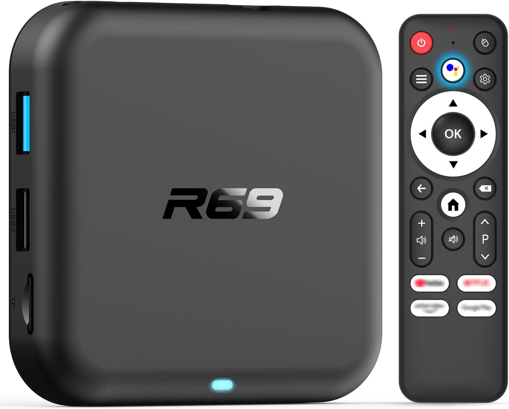

# Armbian on the R69 (a generic RK3518 TV box)



A flash-and-go [Armbian](https://armbian.com/boards/rock-2f) image for the
[**R69**](https://www.amazon.com/dp/B0GK8P5YFT) — a cheap RK3518 ("RK3528-family") Android TV box
that has no idea it's about to run Debian. One script bakes the bring-up into a stock Armbian image;
you flash it to an SD card and boot Linux.

And this is the rare port where that _isn't_ followed by a list of what's broken: **essentially
every peripheral works** — video, audio, Wi-Fi, Bluetooth, the lot ([the scorecard](#what-works) is
refreshingly green). It ships **complete — board, case, PSU brick, remote, HDMI cable — for ~$35**,
where a bare Raspberry Pi 3 (1 GB, bring-your-own-everything) runs ~$55. Even the remote earns its
keep: pair it to [cncjs](https://github.com/cncjs/cncjs) and you've got a wireless pendant for
jogging a CNC. As a tiny always-on Linux box, it's tough to beat.

> Curious how a locked Android box with no documentation got here? →
> **[HOW-IT-WAS-DONE.md](HOW-IT-WAS-DONE.md)**

<br clear="left">

## Is this your box?

This image is built and verified against **one specific box**. Check yours matches before flashing:

|               |                                                                                                |
| ------------- | ---------------------------------------------------------------------------------------------- |
| Name          | **"R69"** (stock `ro.product.name=R69-1`), Android 12                                          |
| SoC           | **RK3518A** — `SoC: 35181001`, reports `rk3528` (RK3518 is a variant inside the RK3528 family) |
| RAM / storage | 2 GB DRAM (**~1.5 GB real**) · 16 GB **Samsung eMMC 5.x** (HS200 — see below) · micro-SD        |
| Wi-Fi / BT    | **AIC8800D80** (SDIO Wi-Fi + UART Bluetooth)                                                   |
| Ports         | HDMI · USB 2.0 · USB 3.0 · 10/100 Ethernet · micro-SD · AV jack                                |
| Remote        | bundled 22-button IR remote                                                                    |
| Serial header | 4 pads by the SD slot, **1500000** baud                                                        |

A **close-but-not-identical** RK3518/RK3528 box can probably be brought up the same way, but will
need its own device-tree tweaks — that whole method is in
**[HOW-IT-WAS-DONE.md](HOW-IT-WAS-DONE.md)**.

## What works

- **✅ Working** — RAM, HDMI video + audio, serial console, Wi-Fi, Ethernet, USB 2.0 & 3.0, SD card,
  CPU temperature, GPU, eMMC, front LED (blue = on / red = standby), IR remote (all 22 buttons),
  Bluetooth, and the **power button** (configurable power-off _or_ suspend-to-RAM; the remote wakes
  it from either).
- **🟡 Not fully tested** — USB 3.0 SuperSpeed, HDMI-CEC, GPU rendering.
- **❓ Untested** — the rear IR-extender jack, the AV jack's analog audio output.
- **❌ Not working** — composite video on the AV jack; the remote's **voice** and **mouse-mode**
  buttons press as plain keys, but their special functions (voice capture, on-screen cursor) aren't
  set up.

**Heads-up**

- **No GPIO header** — no GPIO/I²C/SPI pins. If you need them, add a USB-to-GPIO adapter. The one
  real gap.
- **To fully power off, unplug it.** The power key sleeps or "powers off" but keeps sipping a
  trickle either way — it never quite commits.
- **Bluetooth needs one online step on `minimal` images** — they ship no `bluez`; see
  [Bluetooth](#bluetooth).
- The sticker says **2 GB RAM; it's really ~1.5 GB** — these boxes fib about their RAM; it's
  practically a genre.

## Flash it

Grab a **microSD** (8 GB+; **32 GB+** if you'll install to eMMC, to hold the backup) + reader and a
**stock Armbian base image for the Radxa ROCK 2F**
([armbian.com/boards/rock-2f](https://armbian.com/boards/rock-2f), the `.img.xz`). Then build,
flash, boot:

```bash
# 0. host tools (prerequisite)
brew install e2tools xz coreutils                       # macOS
sudo apt install e2tools xz-utils                       # Debian-like

# 1. build the R69 image from the base
./build-image.sh Armbian_rk35xx_rock-2f.img.xz          # -> Armbian_rk35xx_rock-2f-r69.img

# 2. find card
diskutil list # macOS
lsblk         # Linux

# 3. flash to the card
diskutil unmountDisk /dev/diskN                                                       # macOS
sudo gdd if="Armbian_ABC.img" of=/dev/rdiskN bs=4M conv=fsync status=progress; sync   # macOS
sudo dd  if="Armbian_ABC.img" of=/dev/sdX    bs=4M conv=fsync status=progress; sync   # Linux
# …or just use Balena Etcher

# 4. first boot: insert card, power on, SSH in (or serial @ 1500000 baud), Armbian default root pass is 1234
ssh root@<box-ip>                                        # first login sets a password
```

## Update a running box (no reflash)

Already flashed, and just want the latest DTB / driver / script changes? Apply them in place instead
of rebuilding and reflashing:

```bash
# from your dev machine, over SSH — pushes this repo to the box and applies it:
./r69-deploy root@<box-ip>            # add --reboot to reboot automatically if the DTB changed

# …or on the box itself, from a checkout or straight from GitHub:
sudo ./r69-update                     # run from a repo checkout on the box
sudo r69-update --pull                # or fetch the repo first (needs git)
```

It installs the firmware payload, refreshes + rebuilds the IR and Ethernet-PHY DKMS modules,
reinstalls the device tree, and restarts the changed services — **rebooting only if `board.dtb`
actually changed** (the bootloader is never touched). It reads the same `firmware/payload.list` the
image build uses, so the two never drift.

## Customizing

Everything below is optional — the defaults already work, so skip to whatever itch you've got.

**Front LED** — two entries under `/sys/class/leds/`: `power` (blue), `standby` (red).
Live-controllable:

```sh
echo 1 > /sys/class/leds/power/brightness          # on (0 = off)
echo heartbeat > /sys/class/leds/standby/trigger    # pulse (none = back to manual)
```

**Power button — off vs suspend** — default is a clean `poweroff` (the remote cold-boots it back in
~10–15 s). Switch to **suspend-to-RAM** (remote wakes instantly, Wi-Fi session intact):

```sh
sudo sed -i 's/HandlePowerKey=.*/HandlePowerKey=suspend/' /etc/systemd/logind.conf.d/zz-r69-powerkey.conf
sudo systemctl restart systemd-logind     # suspend -> poweroff to switch back
```

<a id="bluetooth"></a>**Bluetooth** — `minimal` images ship no `bluez`, and first boot never
downloads anything. Install it once and re-run the setup (it configures + starts BT, installs
nothing):

```sh
sudo apt install bluez
sudo /usr/local/sbin/r69-firstboot
```

Then `hci0` comes up every boot and `bluetoothctl` works normally.

**IR remote** — built and loaded automatically on first boot (the remote + power button need it). To
rebuild by hand (e.g. after a kernel change) or test keys:

```sh
rockchip-pwm-remotectl-r69-setup   # DKMS rebuild + load; survives kernel updates
evtest /dev/input/event4           # press remote keys (apt install evtest)
```

The remote shows up as input device **`ffa90030.pwm`** (default `/dev/input/event4`; the number can
shift — confirm with `evtest`). All 22 buttons emit standard Linux key events, with scancodes from
`rockchip,usercode = <0xfb05>` in `firmware/board.dts`:

| Button                      | Key event        |
| --------------------------- | ---------------- |
| Power                       | `KEY_POWER`      |
| OK (center)                 | `KEY_ENTER`      |
| Up                          | `KEY_UP`         |
| Down                        | `KEY_DOWN`       |
| Left                        | `KEY_LEFT`       |
| Right                       | `KEY_RIGHT`      |
| Back                        | `KEY_BACK`       |
| Home                        | `KEY_HOME`       |
| Delete                      | `KEY_BACKSPACE`  |
| Hamburger (menu)            | `KEY_MENU`       |
| Cog (settings)              | `KEY_SETUP`      |
| Voice                       | `KEY_HELP`       |
| Mouse                       | `KEY_TEXT`       |
| Volume up                   | `KEY_VOLUMEUP`   |
| Volume down                 | `KEY_VOLUMEDOWN` |
| Mute                        | `KEY_MUTE`       |
| Page up                     | `KEY_PAGEUP`     |
| Page down                   | `KEY_PAGEDOWN`   |
| YouTube (top-left)          | `KEY_F6`         |
| Netflix (top-right)         | `KEY_F7`         |
| Prime Video (bottom-left)   | `KEY_F3`         |
| Google Play (bottom-right)  | `KEY_F8`         |

**Toothpick button** — the recessed button behind the AV jack (press with a toothpick) is an
`adc-keys` input: Linux sees it as a keypress (`KEY_VOLUMEUP`) on `/dev/input/event3` — a free
button to remap. Test:

```sh
evtest /dev/input/event3           # press with a toothpick (apt install evtest)
```

**Ethernet PHY** — the integrated RK630 PHY needs its vendor driver for OTP calibration (without it
some units drop to 10 Mb/s); it's built + loaded automatically on first boot, like the IR driver, so
Ethernet links at 100 Mb/s out of the box. To rebuild by hand or check which driver holds the PHY:

```sh
rk630-phy-r69-setup                          # DKMS rebuild + load; survives kernel updates
readlink /sys/class/net/end0/phydev/driver   # want "RK630 PHY", not "Generic PHY"
```

**Run from eMMC** (optional, but worth it) — the Samsung eMMC (capped at **HS200 / 100 MHz** for
write reliability — see below) still beats any microSD in the slot, especially on random I/O.
Migrating wipes the eMMC's factory Android, and **you can't re-dump it later** (no root from
the Android menus; USB-OTG maskrom untested here), so **back it up first — that dump is your only
way back to stock**. Use an SD **at least 2× the eMMC** (≥ 32 GB) so the ~16 GB backup fits
alongside the system. Booted from the SD:

```sh
sudo dd if=/dev/mmcblk1 of=/root/emmc-stock.img bs=4M status=progress    # 1. back up Android (your only undo)
sudo armbian-install                                                     # 2. choose "Boot from eMMC / system on eMMC"
sudo dd if=/dev/mmcblk0 of=/dev/mmcblk1 bs=512 skip=64    seek=64    count=16320 conv=notrunc   # 3. restore R69 idbloader
sudo dd if=/dev/mmcblk0 of=/dev/mmcblk1 bs=512 skip=16384 seek=16384 count=8192  conv=notrunc; sync  #    + our u-boot.itb
sudo poweroff                                                            # 4. pull the SD — it boots from eMMC
```

Steps 3–4 copy the R69 loaders back from the SD's own boot sectors (`armbian-install` overwrites
sectors 64 + 16384 with stock blobs that won't boot this box). Afterward, **move the backup off the
card to durable storage** — it shouldn't live only on the SD. On your computer, read it out of the
SD's rootfs with e2tools:

```sh
e2cp /dev/diskNs1:/root/emmc-stock.img emmc-stock.img    # macOS diskNs1 · Linux sdX1 (the SD's rootfs)
```

> **Not yet run end-to-end on this box — verify each step.** `mmcblk1` = eMMC, `mmcblk0` = your SD
> (confirm with `lsblk`; swapping them overwrites your SD).

> **Why HS200, not HS400?** The eMMC used to run HS400ES / 200 MHz (the ROCK 2F default, good for
> ~290 MB/s reads), but HS400ES **writes** corrupt on this board — reads are strobe-timed and fine,
> writes aren't. It's now capped at HS200 / 100 MHz to match the factory, trading peak read
> throughput for write integrity on your root device. Details in
> **[HOW-IT-WAS-DONE.md](HOW-IT-WAS-DONE.md)**.

<a id="back-to-stock"></a>**Back to stock / recovery**

- **Never migrated (still on SD)** — just **eject the SD**; the eMMC's factory Android is untouched
  and boots with no SD in. No backup needed.
- **Migrated to eMMC, want Android back** — boot an Armbian SD (it leaves the eMMC alone), put the
  `emmc-stock.img` you saved during the eMMC install where it can reach it, and write it over the
  whole eMMC:
  ```sh
  sudo dd if=emmc-stock.img of=/dev/mmcblk1 bs=4M status=progress; sync
  ```
- **Only the bootloader is broken** (e.g. sector 64 clobbered) — rewrite just the loaders:
  ```sh
  EMMC=/dev/mmcblk1   # eMMC whole-disk node — NOT your SD
  sudo dd if=firmware/factory_idbloader.bin of=$EMMC seek=64    conv=notrunc
  sudo dd if=firmware/u-boot.itb            of=$EMMC seek=16384 conv=notrunc; sync
  ```

> **Golden rule:** never overwrite **sector 64** with a non-factory idbloader — it holds the DDR
> tuning for your exact DRAM die.

## License & credits

The original RK3518 bring-up — the DDR/idbloader investigation, the AIC8800 SDIO work, and the "edit
the vendor DTB" method — is by
**[juliovendramini/rk3518_armbian](https://github.com/juliovendramini/rk3518_armbian)**. This repo
applies that method to the R69 and reduces it to one script.

- **Scripts** (`build-image.sh`, `build-uboot.sh`, the `firmware/` helpers) — **MIT**.
- **Device tree** (`firmware/board.dts`/`.dtb`) — derived from the mainline Linux **Radxa ROCK 2F**
  DT, **GPL-2.0+ / MIT**; distributing it carries those terms.
- **`firmware/factory_idbloader.bin`, `u-boot.itb`** — Rockchip/U-Boot/ATF blobs, under their own
  licenses.
